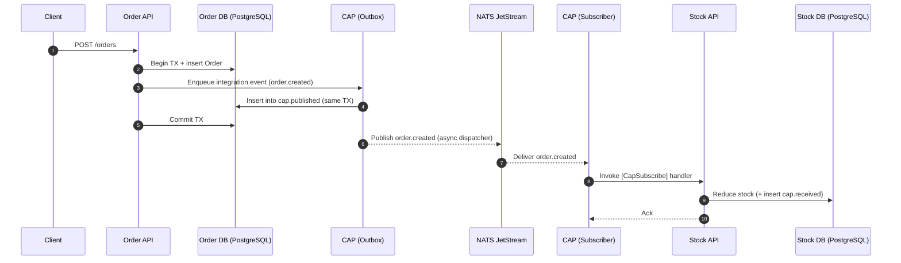

# Transactional and Lightning-Fast Messaging with CAP and NATS (JetStream) using .NET Aspire

## 1. Introduction

In a microservices system, services often need to react to changes happening in other services. The most common approach is event-driven messaging: when something happens in Service A, it publishes an event, and Service B reacts.

The problem is that “publish an event” is easy to write but hard to make reliable. If your service saves data in a database and publishes a message to a broker, you’ve created a classic failure scenario: the database write might succeed while message publishing fails (or vice versa). That’s how missing stock updates and inconsistent state happen.

This article walks through a minimal flow:

- **Order Service** creates an order and publishes `order.created`
- **Stock Service** subscribes to `order.created` and reduces inventory 

Stack used in this POC:

- **DotNetCore.CAP** for transactional messaging (Outbox pattern + retries + dashboard)
- **NATS JetStream** as the high-performance transport
- **PostgreSQL** for application storage + CAP outbox tables
- **.NET Aspire** to run everything locally with minimal wiring

---

## 2. What is the Outbox Pattern?

### The dual-write problem
A typical “publish an event” flow looks like this:

1. Save business data in the database
2. Publish an event to the message broker

If step (1) succeeds and step (2) fails, you’ve permanently lost the event unless you add compensating logic.

### How the Outbox pattern solves it
The Outbox pattern changes the flow:

1. Save business data
2. Save the outgoing message **in the same database transaction**
3. After commit, a background dispatcher publishes the message to the broker

This guarantees: *if the business data is committed, the event is not lost*.

### Why CAP uses this pattern
CAP implements the outbox automatically when configured with a database provider. It persists message state in tables such as:

- `cap.published` (outgoing messages)
- `cap.received` (incoming message tracking)

---

## 3. Overview of CAP

**DotNetCore.CAP** is a .NET library that provides **reliable messaging** with a clean developer experience.

Key features:

- **Outbox pattern** (transactional outbox)
- **Retries** and failure tracking
- **Dashboard** for visibility
- Attribute-based subscribers via `[CapSubscribe]`

When to use CAP:

- You need reliable integration events between services
- You want an outbox without building one yourself
- You want transport flexibility (RabbitMQ, Kafka, NATS, etc.)

---

## 4. Overview of NATS (and why JetStream matters)

**NATS** is a lightweight, high-performance messaging system:

- Very low latency
- Simple subject-based routing
- Small operational footprint

### JetStream
CAP’s NATS integration relies on **JetStream APIs**.

If JetStream is not enabled, publish attempts can fail with an error similar to:

> `PublisherSentFailedException --> No responders are available for the request`

That means: CAP is calling JetStream (`JS.API.*`) endpoints, but the server has no JetStream responders enabled.

---

## 5. Why Combine CAP with NATS? (Core idea)

This combination works well because each tool covers the other’s weakness:

- **CAP provides reliability** (outbox + retries + message state)
- **NATS provides performance** (fast transport, low overhead)

Result: **transactional + fast messaging** without building your own outbox dispatcher.

Trade-offs to keep in mind:

- Consumers must be safe for **retries** (idempotency)
- JetStream must be enabled
- Event contract versioning is still your responsibility

---

## 6. Architecture Design

Flow:

1. Order API writes the Order to Postgres
2. CAP writes an outbox record in the same transaction (`cap.published`)
3. CAP background dispatcher publishes to NATS subject `order.created`
4. Stock API receives and stores receipt (`cap.received`)
5. Stock handler reduces inventory

### Sequence diagram

---

## 7. Setting Up the Environment with .NET Aspire

.NET Aspire makes local distributed development straightforward by declaring your infrastructure and dependencies in one place.

In this POC, the AppHost defines:

- NATS
- Postgres + two databases (`orderdb`, `stockdb`)
- Two services (`order-api`, `stock-api`) referencing those resources

This gives you:

- Automatic connection string injection via `.WithReference(...)`
- Coordinated startup via `.WaitFor(...)`

### Enabling JetStream in AppHost
In this POC, the fix for the “No responders” error is enabling JetStream on the NATS resource:

- File: `Aspire/AppHost/AppHost.cs`
- NATS: `.WithJetStream()`

---

## 8. Configuring CAP with NATS

Each service configures CAP with:

1. EF + Postgres for outbox/inbox persistence
2. NATS for transport
3. Dashboard for visibility

Typical setup (conceptually):

- `UseEntityFramework<DbContext>()`
- `UsePostgreSql(connectionString)`
- `UseNATS(...)`
- `UseDashboard()`

---

## 9. Implementing the Publisher (Outbox)

The Order service publishes an event like `order.created` through CAP.

Under the hood:

- CAP stores the message in the outbox first
- After the DB transaction commits, CAP dispatches it to NATS
- If dispatch fails, CAP retries later (message isn’t lost)

This is the main benefit: **publishing is not best-effort**.

---

## 10. Implementing the Subscriber

The Stock service subscribes using `[CapSubscribe]`.

In this POC:

- Topic is centralized in `Shared.Messaging.Cap.CapTopics`
- The subscriber is `Stock.Infrastructure.Handlers.StockSubscriber`
- The payload is strongly typed (`OrderCreatedEvent`)

Important note: CAP can retry deliveries, so production subscribers should be designed for idempotency.

---

## 11. Proving it Works (Dashboard + Tables)

Ways to confirm the system is working:

1. **CAP Dashboard**
   - Subscribers list shows `order.created`
   - Message status shows success/failures/retries
2. **Database tables**
   - `cap.published`: outgoing messages
   - `cap.received`: incoming processing state
3. **Behavior**
   - Create order → stock decreases

---

## 12. Common Pitfalls

- **JetStream not enabled** → `No responders are available for the request`
- Subscriber not resolved/discovered (DI registration missing)
- Topic mismatch (`order.created` must match exactly)
- Contract drift without versioning strategy

---

## 13. Conclusion

CAP + NATS JetStream is a practical combination when you want **transactional reliability** plus **high-speed messaging**.

Adding .NET Aspire makes the POC easier to run, demo, and reproduce: one AppHost describes the infra + service wiring.

Next steps:

- Add idempotency handling in consumers
- Add correlation IDs/tracing
- Define an event versioning strategy
